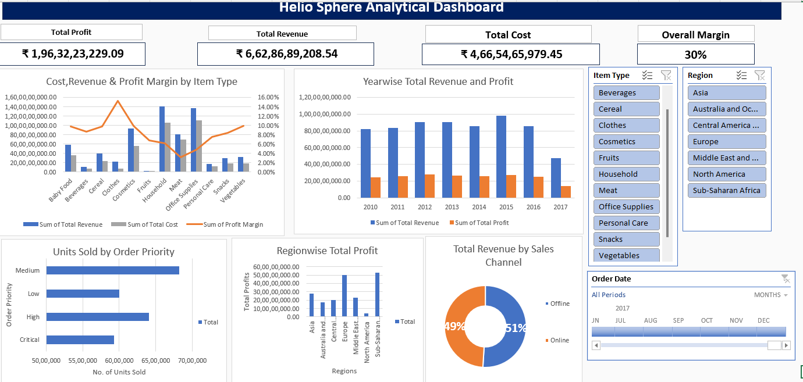

# Global Sales Performance Dashboard using Excel

## Project Overview
This project is an interactive Excel dashboard designed to analyze global sales performance. It provides clear business insights into revenue, cost, profit, profit margin, sales channels, item types, regions, and order priorities.

## Tools Used
- Microsoft Excel
- Pivot Tables
- Pivot Charts
- Dashboard Design
- Data Analysis
- Data Visualization

## Key Metrics Analyzed
- Total Revenue
- Total Cost
- Total Profit
- Profit Margin
- Revenue by Sales Channel
- Revenue and Margin by Item Type
- Revenue and Profit by Year
- Units Sold by Order Priority
- Profit by Region

## Project File
- `Global_Sales_Performance_Dashboard.xlsx`

## Dashboard Insights
- The dashboard helps compare sales performance across different regions.
- It shows revenue and profit trends over the years.
- It highlights the contribution of different item types to revenue and margin.
- It compares sales channel performance.
- It provides a quick view of business KPIs such as revenue, cost, profit, and profit margin.

## Skills Demonstrated
- Excel dashboard creation
- Pivot table analysis
- Chart creation
- Business performance analysis
- KPI reporting
- Data visualization
- Analytical thinking

## Conclusion
This project demonstrates how Excel can be used to build a professional business dashboard for analyzing global sales performance and supporting data-driven decision-making.

## Dashboard Preview

